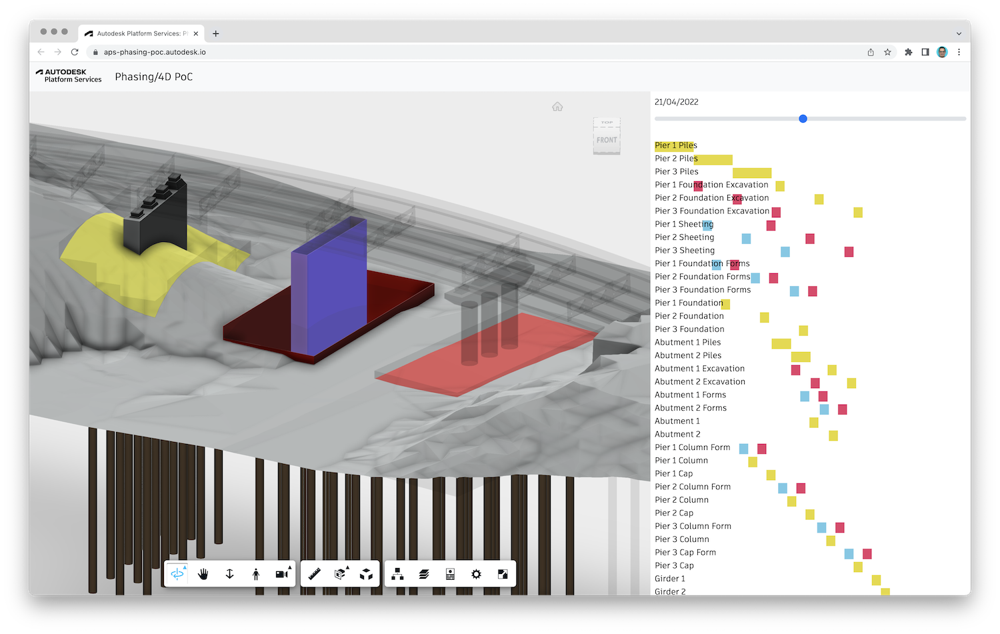

# aps-phasing-poc

Proof-of-concept showing how [Autodesk Platform Services](https://aps.autodesk.com) can be used
to build phasing/4D application.

Live demo: https://aps-phasing-poc.autodesk.io

## Development

### Prerequisites

- [APS Credentials](https://forge.autodesk.com/en/docs/oauth/v2/tutorials/create-app)
- [Node.js](https://nodejs.org) (we recommend the Long Term Support version)
- Terminal (for example, [Windows Command Prompt](https://en.wikipedia.org/wiki/Cmd.exe)
or [macOS Terminal](https://support.apple.com/guide/terminal/welcome/mac))

### Setup & Run

- Clone the repository
- Install dependencies: `npm install`
- Setup environment variables:
  - `APS_CLIENT_ID` - your APS application client ID
  - `APS_CLIENT_SECRET` - your APS application client secret
- Run the server: `npm start`

> When using [Visual Studio Code](https://code.visualstudio.com),
you can specify the env. variables listed above in a _.env_ file in this
folder, and run & debug the application directly from the editor.
